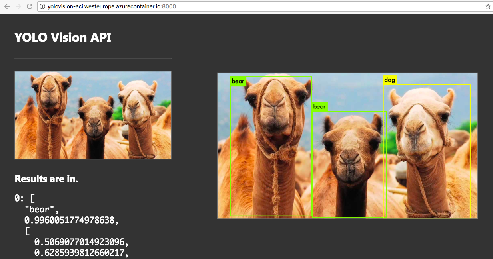

# YoloLens

## A Python wrapper over Darknet Yolo v3

* Frontend lovingly stolen from Sarah Drasner (https://codepen.io/sdras/pen/dZOdpv), [object File] bug included.
* Code contributions into frontend by [Radu Matei](https://github.com/radu-matei).
* Branding by [Bojan Vrhovnik](https://github.com/bojanv)
* Uses the [Yolo v3](https://pjreddie.com/darknet/yolo/) model with default weights

Docker Hub: https://hub.docker.com/r/adcaline/yololens/

Builds with GPU support (CUDA 9.2, Tesla M60 and higher).
